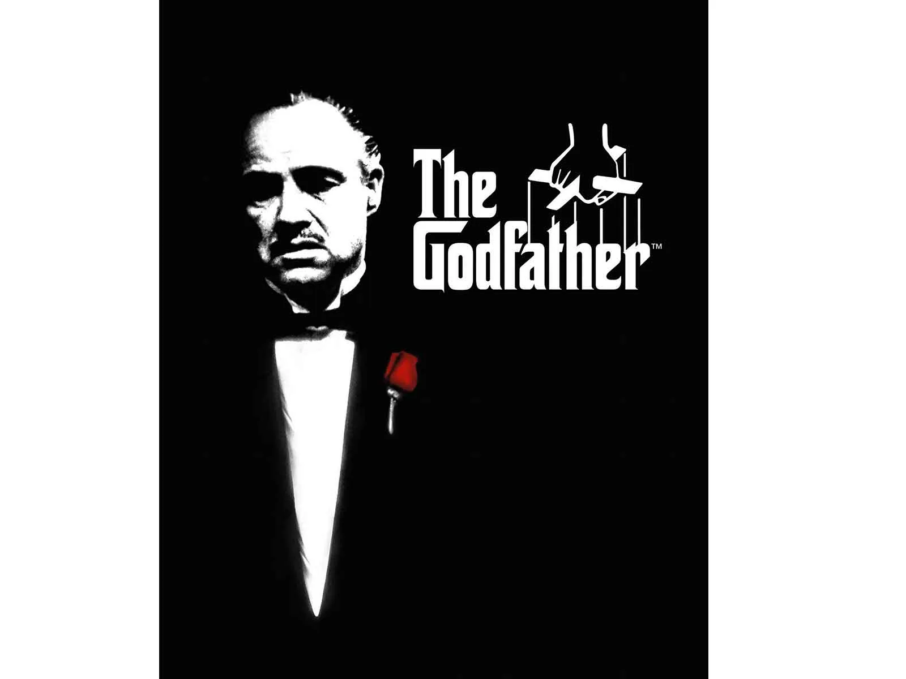

# My Favorite Movie

**GodFather**
*The Godfather is a 1972 American epic gangster film[2] directed by Francis Ford Coppola, who co-wrote the screenplay with Mario Puzo, based on Puzo's best-selling 1969 novel. The film stars an ensemble cast including Marlon Brando, Al Pacino, James Caan, Richard Castellano, Robert Duvall, Sterling Hayden, John Marley, Richard Conte and Diane Keaton. It is the first installment in The Godfather trilogy, chronicling the Corleone family under patriarch Vito Corleone (Brando) from 1945 to 1955. It focuses on the transformation of his youngest son, Michael Corleone (Pacino), from reluctant family outsider to ruthless mafia boss.*

